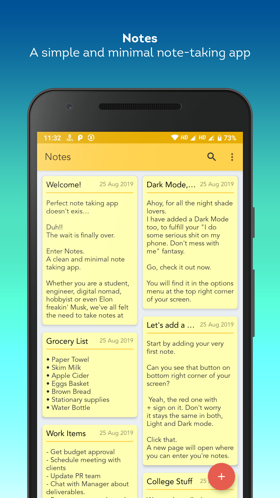
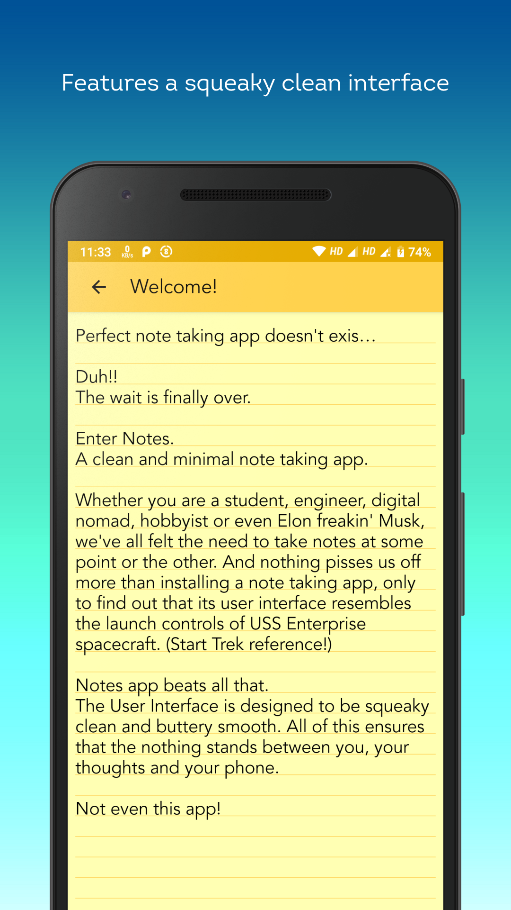
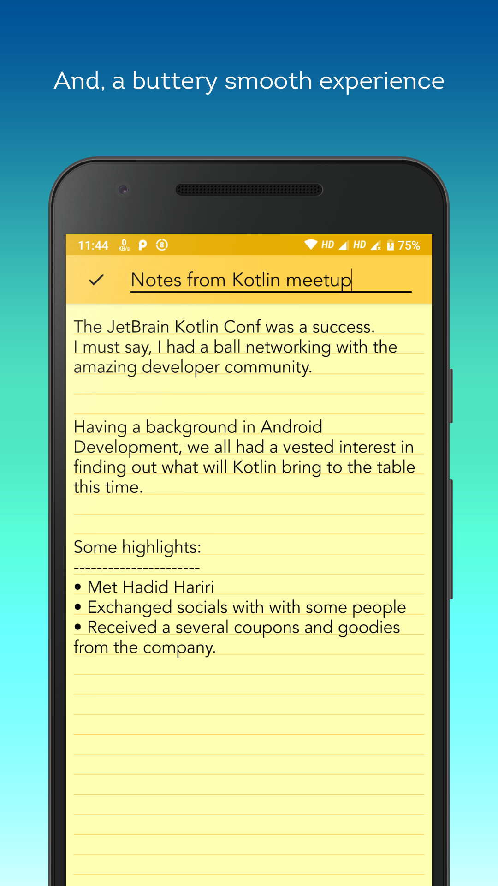
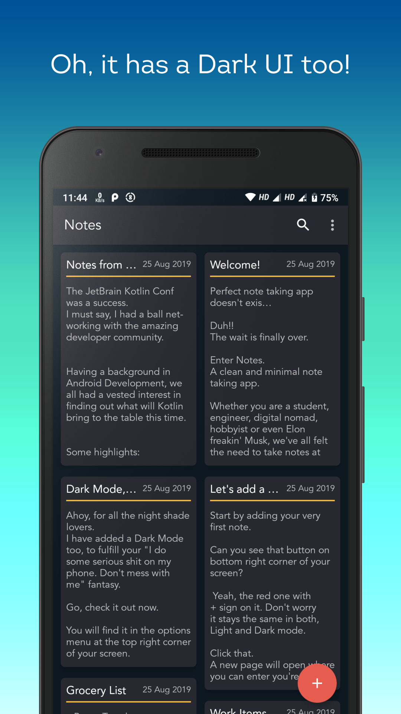
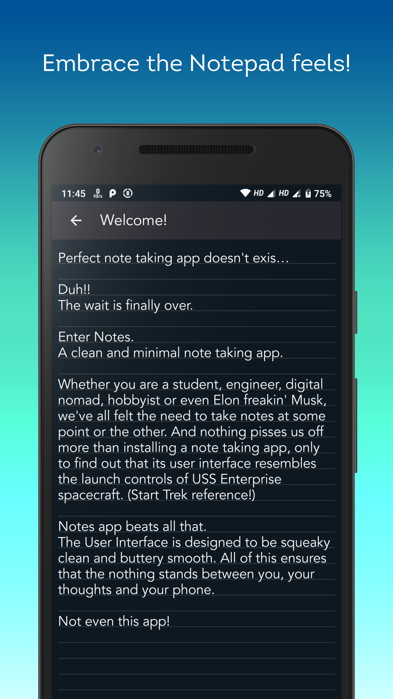
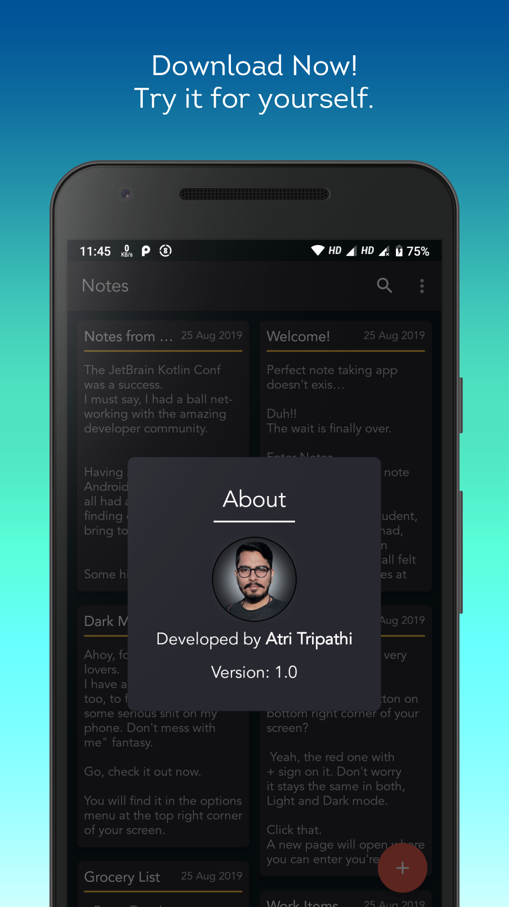

# Notes
Notes - A simple, elegant and minimal note-taking app for android.

## Screenshots
&ensp;&ensp;

&ensp;&ensp;

## Developed by

**Atri Tripathi**

[atritripathi.com](https://atritripathi.com)

## Contributing
If you would like to contribute to the app, feel free to make a Pull requests. 
You can also Star this repository to stay updated with the latest changes.

## License

      Copyright 2019 Atri Tripathi

      Licensed under the Apache License, Version 2.0 (the "License");
      you may not use this file except in compliance with the License.
      You may obtain a copy of the License at

          http://www.apache.org/licenses/LICENSE-2.0

      Unless required by applicable law or agreed to in writing, software
      distributed under the License is distributed on an "AS IS" BASIS,
      WITHOUT WARRANTIES OR CONDITIONS OF ANY KIND, either express or implied.
      See the License for the specific language governing permissions and
      limitations under the License.

